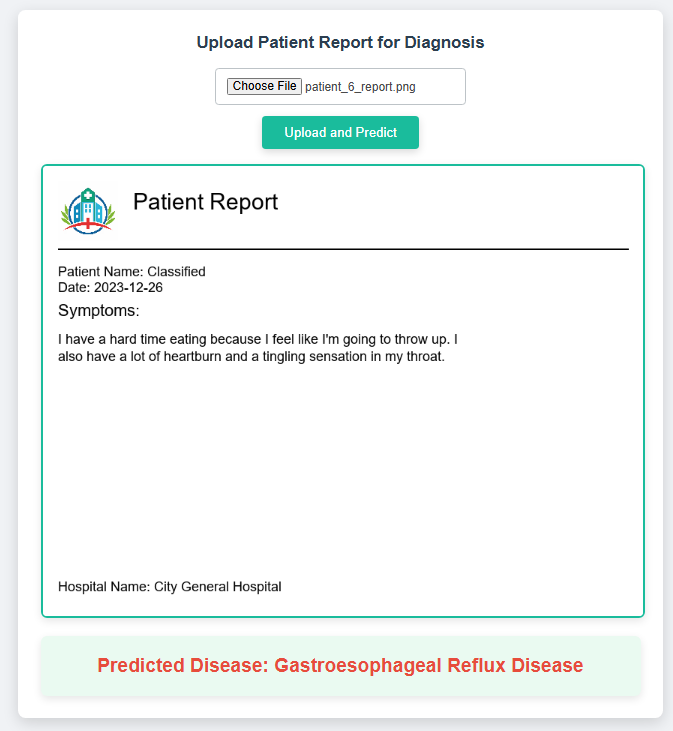
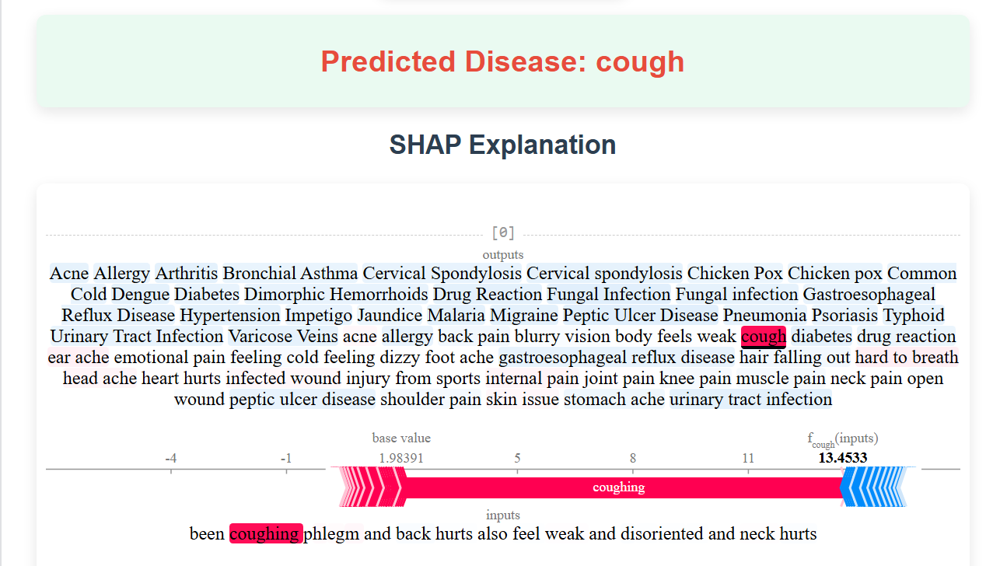

# 🏥 Federated NLP-Driven Medical Disease Classification with Explainable Transformer-Based Architectures


## 🚀 Overview

This project presents a **Federated, Privacy-Preserving Medical Disease Classification System** built from patient symptom report **images** using:

* **OCR (Tesseract)** to extract text
* **BERT Transformer** for classification
* **Federated Learning** for decentralized training
* **Explainable AI** with **SHAP** (and optionally LIME)
* **Flask Web App** for real-time deployment

By combining NLP, decentralized learning, and model interpretability, this system ensures **scalability**, **explainability**, and **data privacy**—vital for real-world healthcare applications.

---

## 📂 Directory Structure

```bash
📦 Federated-Medical-Disease-Classification
├── flask                      # Web interface and global model integration
│   ├── app.py
│   ├── bert_base_cased_local/     # Trained BERT model
│   ├── clinical-stopwords.txt
│   ├── global_model1.pt
│   ├── label_encoder.pkl
│   ├── static/
│   │   ├── shap_plot.html
│   │   └── shap_plot.png
│   ├── templates/
│   │   └── index.html
│   └── tokenizer/              # Tokenizer artifacts
│       ├── vocab.txt
│       ├── tokenizer.json
│       ├── tokenizer_config.json
│       └── special_tokens_map.json
│
├── image recognition          # OCR & text extraction from report images
│   ├── Symptom2Disease_train.csv
│   ├── Symptom2Disease_test.csv
│   ├── gretalai_train.csv
│   ├── gretalai_test.csv
│   ├── venetis_train.csv
│   ├── venetis_test.csv
│   └── img rec.ipynb
│
├── testing                    # Model testing code and datasets
│   ├── bert_test.ipynb
│   ├── clinical-stopwords.txt
│   ├── *.csv (test datasets)
│
├── training                   # Federated training + Explainability
│   ├── clinical-stopwords.txt
│   └── training_fed_exp_bert.ipynb
└── README.md                  # Project documentation
```

---

## 🔧 Features

* ✅ **Federated BERT-based Disease Classification**
* ✅ **OCR-Driven Text Extraction** using Tesseract
* ✅ **SHAP Explainability** for each prediction
* ✅ **Class Imbalance Handling** via SMOTE
* ✅ **Web Deployment** with Flask for real-time use
* ✅ **Secure & Private**: No patient data leaves the local node

---

## ⚙️ How It Works

### 🖼️ 1. Image to Text (OCR)

* Uses **Tesseract OCR** to extract medical text from scanned or photographed symptom reports

### 🧹 2. Text Preprocessing

* Removes generic & clinical stopwords
* Applies lemmatization, regex-based cleaning, tokenization

### 🧠 3. Federated Learning

* **Three Clients** train BERT classifiers locally on separate datasets
* **FedAvg Algorithm** aggregates model weights without sharing raw data

### 📊 4. Explainable AI

* **SHAP** visualizes which symptoms influenced the prediction
* Offers local and global interpretability to promote clinician trust

### 🌐 5. Flask Web App

* Upload report images or text
* Get **real-time disease predictions** with SHAP-based explanation

---

## 📊 Results

| Model            | Accuracy   |
| ---------------- | ---------- |
| Client 1         | 93.87%     |
| Client 2         | 100.00%    |
| Client 3         | 98.75%     |
| **Global Model** | **93.01%** |

**Key Insight:** Even with decentralized, non-IID datasets, the global model generalizes well.

---

## 🧠 Sample SHAP Explanation

* Key Influential Symptoms:

  * High Fever
  * Shortness of Breath
  * Cough Severity
  * SpO2 (Oxygen Saturation)

---

## 🌐 Web Application Screenshots

### 🔹 Upload Symptom Report



### 🔹 SHAP Explanation Output



---

## 🛠️ Setup Instructions

### 🔧 Prerequisites

* Python 3.8+
* PyTorch, Transformers, Flask, SHAP, imbalanced-learn, datasets
* Tesseract OCR installed (with path configured)

### 🚀 Running the Web App

```bash
cd flask
python app.py
```

Then visit: **[http://127.0.0.1:5000](http://127.0.0.1:5000)**

---

## 🗂️ Dataset

* Extracted from real-world patient symptom report **images**
* Stored as CSVs after OCR extraction: `gretalai`, `venetis`, `Symptom2Disease`
* Format: `description`, `disease`

Source: [Patient Symptoms Image Dataset on Kaggle](https://www.kaggle.com/datasets/dpm3333/patient-symptoms-report-image-and-disease-dataset)

---

## 🚀 Future Enhancements

* 🔐 **Differential Privacy & Secure Aggregation**
* 🤖 **LIME Integration** for more local interpretability
* 🧬 **Multimodal Diagnosis**: Combine image scans + text
* 📱 **Edge Deployment**: Optimize model for rural clinics

---


## 🙌 Acknowledgments

* [Kaggle Dataset by dpm3333](https://www.kaggle.com/datasets/dpm3333/patient-symptoms-report-image-and-disease-dataset)
* [HuggingFace Transformers](https://huggingface.co/transformers/)
* [SHAP Library](https://github.com/slundberg/shap)

---

## 🤝 Contributions

Contributions, suggestions, and pull requests are welcome!

> *If this project helped you, leave a ⭐ and spread the word!*
